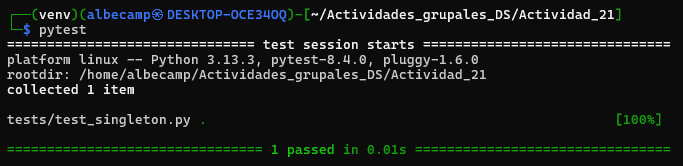

# ACTIVIDAD 21

## Fase 1: Exploración y análisis

### 1.1. Singleton

### 1.2. Factory

### 1.3. Prototype

### 1.4. Composite

### 1.5. Builder

## Fase 2: Ejercicios prácticos

### Ejercicio 2.1: Extensión del Singleton

Primero, añadimos un nuevo método a `singleton.py` llamado `reset()`. Su función será limpiar `settings` pero manteniendo `created_at`.

```python
def reset(self) -> None:
    self.settings.clear()
```

Luego, para validar esta función se crea un nuevo directorio `tests/` donde se creará el archivo `test_singleton.py`. Ahi es donde se realizará el test para probar que la nueva función añadida funciona correctamente.

```python
from iac_patterns.singleton import ConfigSingleton 
import datetime

def test_reset():
    c1 = ConfigSingleton("dev")
    created = c1.created_at
    c1.settings["x"] = 1
    c1.reset()
    assert c1.settings == {}
    assert c1.created_at == created

if __name__ == "__main__":
    test_reset()
```

Al ejecutarlo, notamos que el test pasa, lo cual indica que el método funciona correctamente.

<div align = "center">
    
</div>

### Ejercicio 2.2: Variación de la Factory


### Ejercicio 2.3: Mutaciones avanzadas con Protype


### Ejercicio 2.4: Submódulos con Composite


### Ejercicio 2.5: Builder personalizado


## Fase 3: Desafíos teórico-prácticos

### 3.1. Comparativa Factory vs Prototype


### 3.2 Patrones avanzados: Adapter (código de referencia)


### 3.3 Tests automatizados con pytest


### 3.4 Escalabilidad de JSON


 