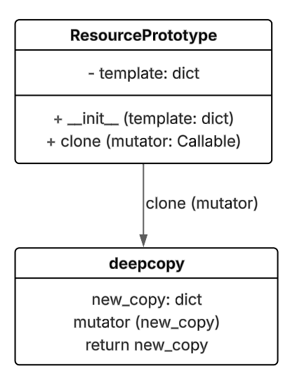
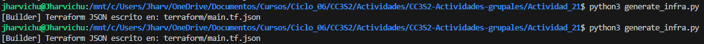

# ACTIVIDAD 21

## Fase 1: Exploración y análisis

### 1.1. Singleton

La clase `SingletonMeta` garantiza que una clase que la utilice como metaclase solo pueda tener una instancia única que se este ejecutando en todo el proceso. 

Asi que define un diccionario que va a almacenar las instancias unicas de las clases que utilizan esta metaclase:

```python
_instances: Dict[type, "ConfigSingleton"] = {}
```

Ademas se crea el objeto `_lock` que servira como seguridad en procesos de multi-hilo, evitando que otros hilos modifiquen un recurso compartido. Se le asigna a esta variable la instancia de la clase `threading.Lock` para que cumpla la funcion de proteger los hilos.

```python
_lock: threading.Lock = threading.Lock()
```

Luego esta el metodo `__call__` que controla las instancias para que sea unica en todo el proceso. Para controlar que solamente existe una instancia verifica si la isntancia creada ya existe, retorna la creada anteriormente

```python
def __call__(cls, *args, **kwargs):
    with cls._lock:
        if cls not in cls._instances:
            cls._instances[cls] = super().__call__(*args, **kwargs)
    return cls._instances[cls]
```

### 1.2. Factory
La fábrica(Factory) encapsula la creación del Null Resource de 4 maneras.

La primera manera de encapsulación es mediante la Abstracción de la estructura interna, la fábrica proporciona un método llamado create(), simplemente el usuario tiene que proporcionar su nombre.

La segunda manera de encapsulación se da cuando la fábrica genera datos para los triggers. En  factory_uuid se crea un UUID usando uuid. uuid4(), esto hace que cada null_resource recientemente dado por la fábrica, pose a un identificador único en sus triggers. El timestamp() registra el tiempo UTC actual. La tercera manera se da cuando la fábrica se preocupa para que todos los null_resource  usen una misma estructura y convención. La última forma de encapsular se da cuando la estructura de null_resource cambia debido a que se le agregaron nuevas propiedades o se le modifico la manera en que se definieron triggers.

Los triggers tienen como propósito no actuar directamente sobre la infraestructura, sino más bien controlar el ciclo de vida de las acciones que tienen que ver con null_resource, pueden hacer que se pueda volver a ejecutar ciertos scripts.

### 1.3. Prototype

El parámetro `mutator` nos permite personalizar cada instancia que clonemos ya que actua como una función que modifica la copia del prototipo. Ahora, cuando se llama al método `clone` se hace una clonación del objeto original gracias a `deppcopy`, con esto nos aseguramos que la copia es totalmente independiente del prototipo. Luego de esto, el `mutator` recibe dicha copia como un argumento y puede modificarla libremente (para cambiar valores o eliminar algunos datos). Todo esto nos permite generar múltiples versiones modificadas de un mismo prototipo sin afectar al original, lo cual nos brinda una forma de reutilizar configuraciones sin la necesidad de redefinir toda la estructura o crear otras clases.

**Diagrama UML:**

<div align = "center">
    
</div>

### 1.4. Composite

Esta clase implementa el patrón `Composite` para manejar recursos de Terraform, permitiendo agrupar múltiples recursos individuales en una estructura unificada.

Primeramente en la clase `CompositeModule`, se inicializa una lista vacia en su constrcutor que almacenará diccionarios de recursos Terraform, donde cada uno tiene su propia estructura.

```python
class CompositeModule:
    def __init__(self) -> None:
        self._children: List[Dict[str, Any]] = []
```

Despues tenemos al metodo `add` que se encarga de añadir recursos individuales que tengan un formato de diccionario en la lista que se creo en su constructor

```python
def add(self, resource_dict: Dict[str, Any]) -> None:
    self._children.append(resource_dict)
```

Y por ultimo tenemos al metodo `export`, en el cual primeramente crea un diccionario base con una lista vacía bajo la clave `resource`:

```python
aggregated: Dict[str, Any] = {"resource", []}
```

Despues recorre cada recurso almacenado en `_children` que fueron añadidos previamente con `add()` por medio de iteración como se muestra:

```python
 for child in self._children:
```

Al recorrer cada hijo obtiene los bloques `resource` y extiende la lista `aggregated["resource"]` con estos bloques que hemos obtenido de los hijos. El metodo resultante seria:

```python
def export(self) -> Dict[str, Any]:
    aggregated: Dict[str, Any] = {"resource": []}
    for child in self._children:
        aggregated["resource"].extend(child.get("resource", []))
    return aggregated
```

Como ejemplo supongamos que tengamos el siguiente codigo en python, donde utilizemos el patron composite:

```python
modulo = CompositeModule()
modulo.add({
    "resource": [
        {"null_resource": {"app1": {"triggers": {"id": 1}}}}
    ]
})
modulo.add({
    "resource": [
        {"null_resource": {"app2": {"triggers": {"id": 2}}}},
        {"local_file": {"config": {"content": "..."}}}
    ]
})
```

Si llamamos al `export()`, primeramente iniciamos con `{"resource":[]}`, luego extrae del primer hijo `["null_resource": {"app1": ...}]` y extiende la lista `aggregated`. De la misma manera para el segundo hijo `[{"null_resource": {"app2": ...}}, {"local_file": ...}]` y extiende la lista `aggregated`, resultando al final:

```json
{
    "resource": [
        {"null_resource": {"app1": {"triggers": {"id": 1}}}},
        {"null_resource": {"app2": {"triggers": {"id": 2}}}},
        {"local_file": {"config": {"content": "..."}}}
    ]
}
```

Una forma de visualizar como actuaria composite, podria ser de la siguiente manera:

``` txt
Recursos Individuales (inputs)          Output Combinado
---------------------------------       ------------------------
{ "resource": [ A ] }                   {
{ "resource": [ B, C ] }                  "resource": [ A, B, C, D ]
{ "resource": [ D ] }                   }
```

### 1.5. Builder
Builder orquesta al composite creando una instancia de CompositeModule, este es importante para agrupar muchos elementos de  infraestructura , acá son recursos, dentro de una estructura jerárquica. Esto hace que Builder pueda adicionar muchos recursos y los pueda exportar.

Se orquesta Factory cuando Builder delega la creación de la estructura base de un null resource a NullResourceFactory. La fábrica NullResourceFactory se encarga de crear la estructura del null_resource con ayuda de sus triggers(UUID y timestamp). Todo esto encapsula lo difícil de formar un null_resource y da una base limpia. Este Builder no  necesita saber mucho acerca de la creación del null_resource, solo la fábrica devolverá un objeto null_resource válido.

Orquestar Prototipo, es un proceso diferente, pues primero que Builder posee la base(null_resource), la usa para inventar ResourcePrototype. El Patrón Prototype es muy importante para mejorar la eficiencia del trabajo. Para que count no cree nuevos null_resurce desde el comienzo con la fábrica, lo cual es muy costoso, el Builder crea un prototipo del recurso.

Nuevamente se hace orquestacion del composite(), para esto primero Builder  llama a el método export() de su self.module().Para esto de aca, se espera  con ansias que CompositeModule.export() otorgue  un diccionario que represente la estructura JSON final de la infraestructura.

Ya por fin se genera el JSON . Finalmente, el Builder toma esta estructura de datos devuelta por el CompositeModule y la escribe en un archivo JSON utilizando json.dump(), con una indentación de 2 para facilitar la lectura.

## Fase 2: Ejercicios prácticos

### Ejercicio 2.1: Extensión del Singleton

Primero, añadimos un nuevo método a `singleton.py` llamado `reset()`. Su función será limpiar `settings` pero manteniendo `created_at`.

```python
def reset(self) -> None:
    self.settings.clear()
```

Luego, para validar esta función se crea un nuevo directorio `tests/` donde se creará el archivo `test_singleton.py`. Ahi es donde se realizará el test para probar que la nueva función añadida funciona correctamente.

```python
from iac_patterns.singleton import ConfigSingleton 
import datetime

def test_reset():
    c1 = ConfigSingleton("dev")
    created = c1.created_at
    c1.settings["x"] = 1
    c1.reset()
    assert c1.settings == {}
    assert c1.created_at == created

if __name__ == "__main__":
    test_reset()
```

Al ejecutarlo, notamos que el test pasa, lo cual indica que el método funciona correctamente.

<div align = "center">
    
</div>

### Ejercicio 2.2: Variación de la Factory

Primeramente añadimos al script `Factory.py` una nueva clase llamada `TimestampedNullResourceFactory` que hereda el comportamiento de la clase `NullResourceFactory`, pero modificando el formato en que se muestra el tiempo en el archivo `.tf` por medio del parametro *fmt*.

```python
class TimestampedNullResourceFactory(NullResourceFactory):

    @staticmethod
    def create(name: str, fmt: str = "%Y/%m/%d %H:%M:%S", triggers: Dict[str, Any] | None = None) -> Dict[str, Any]:
        
        ts = datetime.utcnow().strftime(fmt)

        triggers = triggers or {}
        triggers.setdefault("factory_uuid", str(uuid.uuid4()))
        triggers.setdefault("timestamp", ts)

        return {
            "resource": [{
                "null_resource": [{
                    name: [{
                        "triggers": triggers
                    }]
                }]
            }]
        }
```

Observamos que sigue la misma estructura de `NullResourceFactory`, asi que modificamos `builder.py` ya que lo implementa para contruir en algunas partes del codigo. Asi que modificamos para que nos quede asi y se contruya correctamente el archivo `main.tf`

```python
class InfrastructureBuilder:

    ...

    def build_null_fleet(self, count: int = 5) -> "InfrastructureBuilder":
        base_proto = ResourcePrototype(
            TimestampedNullResourceFactory.create("placeholder") #Parte modificada
        )

    ...

    def add_custom_resource(self, name: str, triggers: Dict[str, Any]) -> "InfrastructureBuilder":
        self._module.add(TimestampedNullResourceFactory.create(name,"%Y/%m/%d", triggers)) #Parte modificada
        return self
```

Despues de modificar y antes de ejecutar el script `generate_infra.py`, observamos como esta estructurado una pequeña parte de `main.tf` antes de ejecutar la modificación.

```json
{
    "resource": [
        {
            "null_resource": [
                {
                    "placeholder_0": [
                        {
                            "triggers": {
                                "factory_uuid": "973aeec8-03c9-482d-9476-a1b77c08c77c",
                                "timestamp": "2025-06-05T01:18:51.600939",
                                "index": 0
                            }
                        }
                    ]
                }
            ]
        },
    ...
}
```

Ahora al ejecutar el script `generate_infra.py`, se muestra el tiempo con la estructura que asignamos en nuestro cambio en una pequeña parte de `main.tf`.

<div align = "center">
    
</div>

```json
{
    "resource": [
        {
            "null_resource": [
                {
                    "placeholder_0": [
                        {
                            "triggers": {
                                "factory_uuid": "235c39e9-ab22-4481-8e88-0b03afaf84e0",
                                "timestamp": "2025/06/06 03:44:39",
                                "index": 0
                            }
                        }
                    ]
                }
            ]
        },
    ...
}
```

### Ejercicio 2.3: Mutaciones avanzadas con Protype


Agregue este método dentro del archivo Prototype.py.

Primero se tiene un diccionario dentro del método(da una configuracion de recursos de Terraform).  Se hacen cambios a los triggers de un recurso null_resource

Al final se grega un recurso local file, que tiene como funcion agregar un archivo de texto


```python
def add_welcome_file(block: dict):

        block["resource"]["null_resource"]["app_0"]["triggers"]["welcome"] = "¡Hola!"

        block["resource"]["local_file"] = {

        "welcome_txt": {

            "content": "Bienvenido",

            "filename": "${path.module}/bienvenida.txt"

        }

    }
```


Dentro de main.tf.json  agregue el bloque local_file, para que me compile un archivo de bienvenida.txt, con su mensaje “¡Hola, bienvenida!”


```
{

            "local_file": {

                "bienvenida": {

                    "content": "¡Hola, bienvenida!",

                    "filename": "${path.module}/bienvenida.txt"

                }

            }

        }
```


Me fui a mi ruta de Terraform y active el entorno virtual .venv.

Primero hice “terraform init" , luego  “terraform plan”,  al final ejecuto Terraform mediante "Terraform Apply".


Se ejecuto perfectamente bien “Terraform Apply”


Se generó un archivo de bienvenida.txt, tal como se tenía planeado desde que se agrego el bloque “local_file” .


### Ejercicio 2.4: Submódulos con Composite


### Ejercicio 2.5: Builder personalizado


## Fase 3: Desafíos teórico-prácticos

### 3.1. Comparativa Factory vs Prototype

#### Patron Factory

El patron **Factory** es un patron creacional que centraliza la lógica de construcción de objetos o recursos en una clase especifica, como si fuera una fabrica, asi que este patron es especialmente útil para generar configuración estandarizada de manera estructurada y mantenible.

- **Ventajas**:
  
  - **Encapsulacion**: La lógica de construccion de recursos se centraliza en una clase Factory (como `NullResourceFactory`) permitiendo que el usuario que necesite la infraestructura no necesite conocer como se ensambla cada bloque, lo que facilita la modificación y el mantenimiento directamente en la clase.
  
    ```python
    # Sin Factory (menos mantenible)
    resource = {
        "resource": {
            "null_resource": {
                "app": {
                    "triggers": {
                        "uuid": "123", 
                        "timestamp": "2025-01-01"
                    }
                }
            }
        }
    }

    # Con Factory (más limpio y reutilizable)
    resource = NullResourceFactory.create("app", triggers={"custom_key": "value"})
    ```
  - **Flexibilidad**: Permite personalizar recursos mediante parametros sin modificar la lógica base como en `TimestampedNullResourceFactory` que podemos cambiar el formato del tiempo y que podemos assignarle *triggers*.
  - **Estandarización**: Permite garantizar que todos los recursos sigan un mismo esquema, evitando errores humanos en la definición manual.

- **Cuando Usarlo**
  - Cuando los recursos que se construiran tienen una estructura predecible y que no requieran clonación.
  - Para evitar la duplicación de código en la creación de configuraciones repetitivas.

#### Patron Prototype

El patrón **Prototype** es un patron de diseño creacional que permite clonar objetos existentes como si fuera un prototipo cambio de crealos desde cero, asi que es especialmente útil para generar recursos con variaciones mínimas de manera eficiente y mantenible.

- **Ventajas**
  - **Reutilización**: Permite clonar configuraciones base y modificarlas sin repetir codigo o evitando riesgos en tener errores.
  - **Personalización**: Permite añadir parametros especificos, modificar atributos, etc. Utiliza los mutadores (`mutador`) ya que reciben una copia y permiten ajustar cada instancia según necesidades especificas asi minimizando errores o configuraciones incompletas.

- **Cuando Usarlo**
  - Cuando se necesite una personalización dinámica, como inputs variables de region, tamaños de VM, etc, utilizando mutadores para aplicar cambios sin modificar el prototipo original.
  - Cuando la recreacion manualmente directa es más costosa que clonar y modificar

### 3.2 Patrones avanzados: Adapter (código de referencia)


### 3.3 Tests automatizados con pytest


### 3.4 Escalabilidad de JSON

Al ejecutar `generate_infra.py` para generar la infraestructura tendra variaciones dependiendo de cuanto necesitemos y pongamos en `build_null_fleet()`. Comparemos el tamaño de `terraform/main.tf` al ejecutar para:

| `build_null_fleet(15)` | `build_null_fleet(150)` |
|------------------------|-------------------------|
| Peso del archivo : 8kb | Peso del archivo : 73kb |

Observamos que hay un considerable aumento del peso del archivo, aproximadamente 10 veces más. Pero, **¿ Qué impactos puede tener en el CI/CD ?**: 

* Tiempo de ejecución: al aumentar los recursos creados en la infraestructura, al ejecutar los comandos `terraform plan/apply` puede aumentar lineal o exponencialmente el tiempo de ejecución en el pipeline.
* Consumo de recursos: al generar mas recursos en nuestra infraestructura, puede que necesite más uso de la memoria RAM asignada en el pipeline.
* Costos ocultos: en caso se utilicen recursos de proveedores de la nube, al aumentar los recursos, puede sobrepasar los limites gratuitos y cobrandonos los recursos extras utilizados en la ejecución.


 