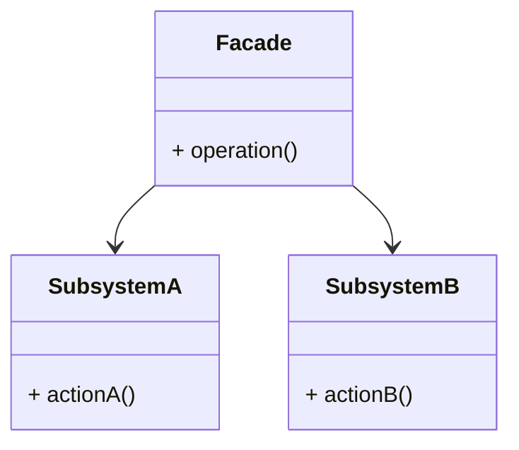
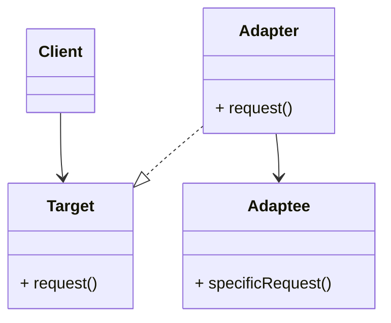
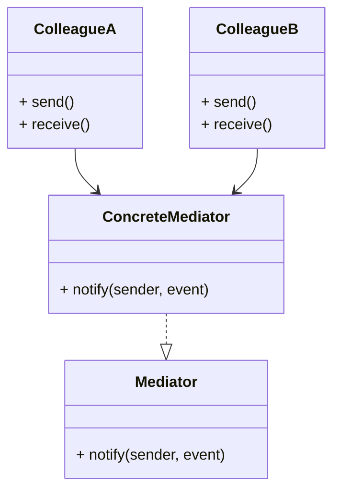

# ACTIVIDAD 22

## Patrones

### Facade

#### Ejercicios Teóricos

##### 1. Comparativa de patrones

**a.** Describe en un diagrama UML las responsabilidades de cada patrón.

- Facade



- Adapter



- Mediator



**b.** Explica por qué elegimos Facade para desacoplar módulos de Terraform y Python en lugar de, por ejemplo, Adapter.

Usamos el patron Facade ya que su función principal es simplificar la interacción de un sistema complejo a usar una interfaz unificada. Cuando usamos terraform, podemos tener varios archivos, configuraciones o comandos complejos que pueden representar un aumento de complejidad. También, al usar Python, este actua como un intermediario para automatizar o controlar dichos módulos de terraform.

Entonces, la ventaja de usar Facade es que podemos crear una capa intermedia en python que agrupe diversas operaciones de Terraform o que exponga métodos simples al resto del sistema.

Ahora, ¿por qué no usar Adapter?, el patrón adapter se usa cuando tenemos formatos/interfaces incompatibles que necesitan trabajar juntas o cuando querramos hacer que una clase ya existente sea compatible con otras sin modificar el código. En caso que tengamos interfaces incompatibles que necesiten ser usadas directamente, entonces sí seria recomendable aplicar el patrón adapter.

**c.** Discute los pros y contras de usar Facade en IaC a gran escala (mantenimiento, legibilidad, potencial de acoplamiento).

- Pros:

    - Centralizamos la lógica de interacción en una única clase o módulo. Si se cambian los comandos o flujos de Terraform, entonces se modificaría solamente la clase Facade y no todo el sistema.

    - Separa la lógica de negocio o de automatización de la complejidad de los propios scripts terraform. Facilita el cambio de "tecnología" sin afectar al resto del sistema.

    - Al diseñar un buen patrón facade se nos permite reutilizar flujos comunes como `init`. `plan`, etc. de forma estandarizada, evitando así la duplicación de código.

- Contras:

    - Si bien desaclopa del sistema, los clientes del facade quedan "pegados" a su interfaz, entonces, si el diseño del patrón no está bien estructurado desde un inicio, puede romper varios módulos dependientes.

    - Si se trabaja en proyectos pequeños, aplicar dicho patrón puede aumentar la complejidad. A veces, ejecutar los comandos directamente es más práctico.

    - Puede dificultar la depuración ya que la abstracción puede ocultar detalles importantes de la ejecución de Terraform (errores o advertencias).

#### Ejercicios Prácticos


### Adapter


  

### Mediator

#### Ejercicios Teóricos


#### Ejercicios Prácticos


## Fases

### Fase 1


### Fase 2

#### Ejercicios Teóricos

####  Principio de Inversión de Control (IoC) en tu código 
El IOC es  un principio de diseño y un concepto clave en la implementación de la inyección de dependencias. Proporciona una forma de diseño y organización del código para lograr una mayor modularidad y flexibilidad.
En el main.py inicial, la clase ServerFactoryModule controlaba de manera directa cómo se obtenía la metadata de red, cargándola desde un archivo JSON dentro de su constructor. Esto proporcionaba  una fuerte dependencia entre la lógica del servidor y el origen de los datos de red. 

Se aplico inversión de control al:
Separar la responsabilidad de obtener la metadata de red (get_network_metadata) de la clase ServerFactory, inyectar un objeto NetworkMetadata como dependencia en el constructor de ServerFactory. 
Esto da a entender  que ServerFactory ya no decide cómo se obtiene la información de red, solo la usa. Este cambio permite: 
Mayor flexibilidad: puedes inyectar metadata desde archivos, bases de datos o incluso pruebas unitarias sin modificar la clase.Menor acoplamiento: ServerFactory no depende de funciones externas o rutas específicas. Mejor mantenibilidad y testeo: puedes simular fácilmente diferentes redes en tests. 


#### Ejercicios Prácticos


``` 
import json 
import ipaddress 
class NetworkMetadata: 
    def __init__(self, name, cidr, subnet_id, vpc_id): 
        self.name = name 
        self.cidr = cidr 
        self.subnet_id = subnet_id 
        self.vpc_id = vpc_id 
class ServerFactory: 
    def __init__(self, server_name, network_metadata): 
      self.server_name = server_name 
        self.network_metadata = network_metadata 
    def allocate_ip(self): 
        network = ipaddress.IPv4Network(self.network_metadata.cidr) 
        return str(list(network.hosts())[4]) 
    def build(self): 
        return { 
            "resource": { 
                "aws_instance": { 
                    self.server_name: { 
                        "ami": "ami-0c55b159cbfafe1f0", 
                        "instance_type": "t2.micro", 
                        "subnet_id": self.network_metadata.subnet_id, 
                        "private_ip": self.allocate_ip(), 
                        "tags": { 
                            "env": "dev", 
                            "team": "infra" 
                        }, 
                        "metadata_options": { 
                            "http_endpoint": "enabled" 
                        } 
                    } 
                } 
            } 
        } 
def get_network_metadata(path="network/network_metadata.json"): 
    with open(path) as f: 
        data = json.load(f) 
    return NetworkMetadata( 
        name=data["name"], 
        cidr=data["cidr"], 
        subnet_id=data["subnet_id"], 
        vpc_id=data["vpc_id"] 
    ) 

if __name__ == "__main__": 
    metadata = get_network_metadata() 
    factory = ServerFactory(server_name="web_server", network_metadata=metadata) 
    result = factory.build()

    with open("server.tf.json", "w") as f: 
        json.dump(result, f, indent=2) 
    print(" server.tf.json generado con inyección de dependencias.") 
``` 
 
 


Se creo un archivo main.tf.json a la hora de ejecturar:


``` 
{ 
  "resource": { 
    "aws_instance": { 
      "web_server": { 
        "ami": "ami-0c55b159cbfafe1f0", 
        "instance_type": "t2.micro", 
        "subnet_id": "subnet-abc123", 
        "private_ip": "10.0.0.5", 
        "tags": { 
          "env": "dev", 
          "team": "infra" 
        }, 
        "metadata_options": { 
          "http_endpoint": "enabled" 
        } 
      } 
    } 
  } 
}
```  


### Fase 3


### Fase 4


### Fase 5

#### teórico 

 
### Diferencias entre Mediator y Facade
#### Propósito: 
El patrón Mediator se enfoca en coordinar la comunicación entre varios objetos o módulos. Es especialmente útil cuando esos componentes necesitan interactuar entre sí de forma compleja o cambiante. En cambio, el patrón Facade busca simplificar el acceso a un sistema complicado, pues nos ofrece una interfaz más sencilla para trabajar con múltiples clases o funcionalidades. 
#### Nivel de control: 
 El Mediator tiene un control alto sobre cómo los objetos interactúan entre sí. Centraliza toda la lógica de interacción en un solo lugar. 
 La Facade, en cambio, no controla tanto; su función es simplemente agrupar y ordenar llamadas a otros subsistemas sin alterar su lógica interna. 

#### Acoplamiento: 
 El Mediator reduce el acoplamiento entre componentes, ya que evita que los objetos se comuniquen directamente. La Facade sí mantiene el acoplamiento con los subsistemas, pero lo hace de forma más ordenada y lo oculta tras una interfaz sencilla. 

#### Flujo de interacción: 
 Con Mediator, el flujo de comunicación es más dinámicoy puede variar según la situación, porque está diseñado para coordinar múltiples partes. 
 En el caso de Facade, el flujo suele ser más lineal y directo: se llama a un método de la fachada y esta se encarga de ejecutar acciones en orden. 

Ejemplo común: 
 Un buen ejemplo del uso de Mediator sería un sistema de chat o de eventos, donde muchos componentes necesitan coordinarse sin depender unos de otros. 
 Un ejemplo típico de Facade sería una API que ofrece funciones sencillas para acceder a una biblioteca compleja, como por ejemplo una que se encargue de procesar imágenes o acceder a servicios en la nube. 
 


#### práctico


Cree el archivo mediator.py dentro de el patrón Mediator, con las configuraciones necesarias. 
Luego me fui a mi ruta cd Actividad_22/Mediator 
Luego ejecute: python3 main.py 
Me genera un archivo main.tf.json con recursos: network, server y firewall, todos bajo el proveedor null_resource.  


``` pyton 
import json  

from pathlib import Path 

# Funciones para verificar si los archivos de configuración existen
 
def check_network_state():

# Verifica si el archivo de configuración de red existe  

return Path("network.tf.json").exists() 

def check_server_state():  

# Checkea si el archivo de configuración del servidor existe  

return Path("server.tf.json").exists() 

def check_firewall_state():  

# Checkea si el archivo de configuración del firewall existe  

return Path("firewall.tf.json").exists() 

# Clase que actúa como el Mediador 

class TerraformMediator:  

def __init__(self):  

# Guarda el estado de cada módulo (True si existe el archivo correspondiente) 

self.states = { "network": check_network_state(), 

 "server": check_server_state(),  

"firewall": check_firewall_state() } 

def validate_dependencies(self): 
    # Valida que los módulos están ahi 
    if not self.states["network"]: 
        raise RuntimeError(" Falta la configuración de la red (network.tf.json)") 
    if not self.states["server"]: 
        raise RuntimeError(" Falta la configuración del servidor (server.tf.json)") 
    if not self.states["firewall"]: 
        raise RuntimeError(" Falta la configuración del firewall (firewall.tf.json)") 
 
def generate_main_tf(self): 
    print(" Todos los módulos están presentes. Generando main.tf.json...") 
    # Estructura centralizada con dependencias simuladas 
    main_tf = { 
        "resource": { 
            "null_resource": { 
                "network": { 
                    "triggers": { 
                        "name": "vpc-dev" 
                    } 
                }, 
                "server": { 
                    "triggers": { 
                        "subnet": "subnet-1234", 
                        "ip": "10.0.0.5" 
                    }, 
                    "depends_on": ["null_resource.network"] 
                }, 
                "firewall": { 
                    "triggers": { 
                        "allow_ssh": True 
                    }, 
                    "depends_on": [ 
                        "null_resource.network", 
                        "null_resource.server" 
                    ] 
                } 
            } 
        } 
    } 
 
    # Guarda la estructura JSON en el archivo final main.tf.json 
    with open("main.tf.json", "w") as f: 
        json.dump(main_tf, f, indent=2) 
 
    print(" main.tf.json generado con éxito.") 
  

# Punto de entrada principal del script 

if name == "main":  

mediator = TerraformMediator()  

try:  

     # Valida que todos los archivos estén presentes  

     mediator.validate_dependencies()  

     # Genera el archivo main.tf.json con dependencias  

     mediator.generate_main_tf()  

except RuntimeError as e:  

# Captura y muestra errores si falta algún archivo  

print(e) 
```  
 


### Fase 6


### Fase 7


### Fase 8


### Fase 9


## Ejercicios Adicionales

### Ejercicio 1


### Ejercicio 2


### Ejercicio 3


### Ejercicio 4


### Ejercicio 5


### Ejercicio 6


#### Multi-repositorio: 

Flujo por repositorio (por módulo): 

main → rama estable del módulo. 

feature/ → cambios individuales. 

Pull Request → revisión y merge en main. 

Etiquetas (v1.0.1, v1.1.0, etc.) por módulo. 

Gestión de versiones: 

Cada módulo tiene su propio ciclo de versiones. Mayor independencia, menor coordinación global. 

### Ejercicio 7

#### 7. Justifica el uso de versionado semántico en módulos Terraform. ¿Qué consecuencias podría tener omitirlo? 

El versionado semántico (MAJOR.MINOR.PATCH) permite: 

Claridad para consumidores del módulo, compatibilidad garantizada cuando solo cambian versiones MINOR o PATCH, automatización de upgrades seguros (con constraints como ~> 1.2.0). 

Consecuencias de omitirlo: 
Usuarios no sabrán si una actualización rompe compatibilidad. Ser{a mas difícil la conservación en proyectos grandes. Aumento de errores en CI/CD y en despliegues automatizados. Dificultad para auditar cambios entre versiones. 

### Ejercicio 8

La política de versiones sigue el esquema semántico MAJOR.MINOR.PATCH, con normas claras y una cadencia establecida para cada tipo de versión: 

Versión PATCH: Se utiliza para correcciones de errores que no afectan la interfaz pública ni introducen nuevas funcionalidades. 
Ejemplo: v1.2.1 
Cadencia: Bajo demanda, cada vez que se corrige un bug. 
Versión MINOR: Se libera cuando se agregan nuevas funcionalidades que son compatibles con versiones anteriores. 
Ejemplo: v1.3.0 
Cadencia: Cada 2 a 4 semanas. 
Versión MAJOR: Se utiliza para cambios que rompen compatibilidad con versiones anteriores, como cambios en nombres de recursos o variables requeridas. 
Ejemplo: v2.0.0 
Cadencia: Cada 3 a 6 meses. 
Normas adicionales: 
Cada Pull Request (PR) significativo debe actualizar el archivo CHANGELOG.md. 
Todas las versiones, sin excepción  deben ser verificadas en entornos de staging antes de aplicar el tag correspondiente. 
 


### Ejercicio 9

Terraform Cloud Registry ofrece accesibilidad global, integración con búsqueda, y documentación automática. Es lo más recomendado  cuando se quiere compartir módulos públicamente o entre múltiples organizaciones. Pero, depende de un servicio externo y requiere cuentas en Terraform Cloud ( versión Enterprise). La autenticación tiene limitaciones y el control del entorno es menor. 
Repositorio Git Interno, por otro lado, da un control total sobre la infraestructura, autenticación, y procesos de CI/CD. Se usa más  para entornos corporativos con políticas estrictas de seguridad. Necesita más  mantenimiento e infraestructura adicional para manejar el versionado, autenticación, y visibilidad, pero puede abstenerse completamente de internet. 


### Ejercicio 10


### Ejercicio 11


### Ejercicio 12


### Ejercicio 13


### Ejercicio 14


### Ejercicio 15


### Ejercicio 16


