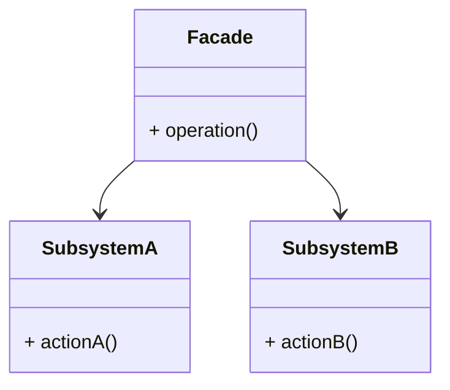
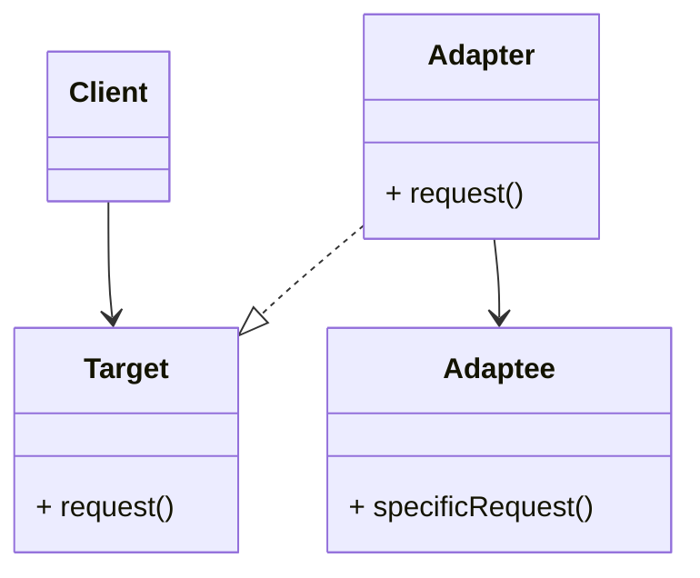
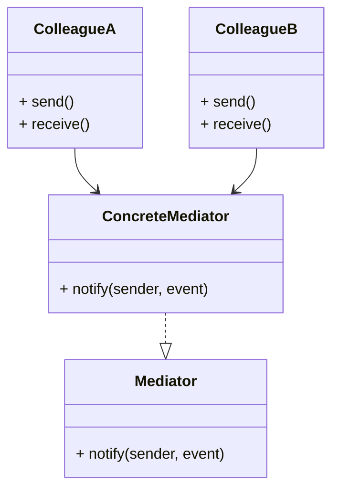

# ACTIVIDAD 22

## Patrones

### Facade

#### Ejercicios Teóricos

##### 1. Comparativa de patrones

**a.** Describe en un diagrama UML las responsabilidades de cada patrón.

- Facade



- Adapter



- Mediator



**b.** Explica por qué elegimos Facade para desacoplar módulos de Terraform y Python en lugar de, por ejemplo, Adapter.

Usamos el patron Facade ya que su función principal es simplificar la interacción de un sistema complejo a usar una interfaz unificada. Cuando usamos terraform, podemos tener varios archivos, configuraciones o comandos complejos que pueden representar un aumento de complejidad. También, al usar Python, este actua como un intermediario para automatizar o controlar dichos módulos de terraform.

Entonces, la ventaja de usar Facade es que podemos crear una capa intermedia en python que agrupe diversas operaciones de Terraform o que exponga métodos simples al resto del sistema.

Ahora, ¿por qué no usar Adapter?, el patrón adapter se usa cuando tenemos formatos/interfaces incompatibles que necesitan trabajar juntas o cuando querramos hacer que una clase ya existente sea compatible con otras sin modificar el código. En caso que tengamos interfaces incompatibles que necesiten ser usadas directamente, entonces sí seria recomendable aplicar el patrón adapter.

**c.** Discute los pros y contras de usar Facade en IaC a gran escala (mantenimiento, legibilidad, potencial de acoplamiento).

- Pros:

    - Centralizamos la lógica de interacción en una única clase o módulo. Si se cambian los comandos o flujos de Terraform, entonces se modificaría solamente la clase Facade y no todo el sistema.

    - Separa la lógica de negocio o de automatización de la complejidad de los propios scripts terraform. Facilita el cambio de "tecnología" sin afectar al resto del sistema.

    - Al diseñar un buen patrón facade se nos permite reutilizar flujos comunes como `init`. `plan`, etc. de forma estandarizada, evitando así la duplicación de código.

- Contras:

    - Si bien desaclopa del sistema, los clientes del facade quedan "pegados" a su interfaz, entonces, si el diseño del patrón no está bien estructurado desde un inicio, puede romper varios módulos dependientes.

    - Si se trabaja en proyectos pequeños, aplicar dicho patrón puede aumentar la complejidad. A veces, ejecutar los comandos directamente es más práctico.

    - Puede dificultar la depuración ya que la abstracción puede ocultar detalles importantes de la ejecución de Terraform (errores o advertencias).

#### Ejercicios Prácticos


### Inyección de dependencias

#### Ejercicios Teóricos

####  Principio de Inversión de Control (IoC) en tu código 
El IOC es  un principio de diseño y un concepto clave en la implementación de la inyección de dependencias. Proporciona una forma de diseño y organización del código para lograr una mayor modularidad y flexibilidad.
En el main.py inicial, la clase ServerFactoryModule controlaba de manera directa cómo se obtenía la metadata de red, cargándola desde un archivo JSON dentro de su constructor. Esto proporcionaba  una fuerte dependencia entre la lógica del servidor y el origen de los datos de red. 

Se aplico inversión de control al:
Separar la responsabilidad de obtener la metadata de red (get_network_metadata) de la clase ServerFactory, inyectar un objeto NetworkMetadata como dependencia en el constructor de ServerFactory. 
Esto da a entender  que ServerFactory ya no decide cómo se obtiene la información de red, solo la usa. Este cambio permite: 
Mayor flexibilidad: puedes inyectar metadata desde archivos, bases de datos o incluso pruebas unitarias sin modificar la clase.Menor acoplamiento: ServerFactory no depende de funciones externas o rutas específicas. Mejor mantenibilidad y testeo: puedes simular fácilmente diferentes redes en tests. 


#### Ejercicios Prácticos


``` 
import json 
import ipaddress 
class NetworkMetadata: 
    def __init__(self, name, cidr, subnet_id, vpc_id): 
        self.name = name 
        self.cidr = cidr 
        self.subnet_id = subnet_id 
        self.vpc_id = vpc_id 
class ServerFactory: 
    def __init__(self, server_name, network_metadata): 
      self.server_name = server_name 
        self.network_metadata = network_metadata 
    def allocate_ip(self): 
        network = ipaddress.IPv4Network(self.network_metadata.cidr) 
        return str(list(network.hosts())[4]) 
    def build(self): 
        return { 
            "resource": { 
                "aws_instance": { 
                    self.server_name: { 
                        "ami": "ami-0c55b159cbfafe1f0", 
                        "instance_type": "t2.micro", 
                        "subnet_id": self.network_metadata.subnet_id, 
                        "private_ip": self.allocate_ip(), 
                        "tags": { 
                            "env": "dev", 
                            "team": "infra" 
                        }, 
                        "metadata_options": { 
                            "http_endpoint": "enabled" 
                        } 
                    } 
                } 
            } 
        } 
def get_network_metadata(path="network/network_metadata.json"): 
    with open(path) as f: 
        data = json.load(f) 
    return NetworkMetadata( 
        name=data["name"], 
        cidr=data["cidr"], 
        subnet_id=data["subnet_id"], 
        vpc_id=data["vpc_id"] 
    ) 

if __name__ == "__main__": 
    metadata = get_network_metadata() 
    factory = ServerFactory(server_name="web_server", network_metadata=metadata) 
    result = factory.build()

    with open("server.tf.json", "w") as f: 
        json.dump(result, f, indent=2) 
    print(" server.tf.json generado con inyección de dependencias.") 
``` 
 
 


Se creo un archivo main.tf.json a la hora de ejecturar:


``` 
{ 
  "resource": { 
    "aws_instance": { 
      "web_server": { 
        "ami": "ami-0c55b159cbfafe1f0", 
        "instance_type": "t2.micro", 
        "subnet_id": "subnet-abc123", 
        "private_ip": "10.0.0.5", 
        "tags": { 
          "env": "dev", 
          "team": "infra" 
        }, 
        "metadata_options": { 
          "http_endpoint": "enabled" 
        } 
      } 
    } 
  } 
}
``` 
  

### Mediator

#### Ejercicios Teóricos


#### Ejercicios Prácticos


## Fases

### Fase 1


### Fase 2


### Fase 3


### Fase 4


### Fase 5


### Fase 6


### Fase 7


### Fase 8


### Fase 9


## Ejercicios Adicionales

### Ejercicio 1


### Ejercicio 2


### Ejercicio 3


### Ejercicio 4


### Ejercicio 5


### Ejercicio 6


### Ejercicio 7


### Ejercicio 8


### Ejercicio 9


### Ejercicio 10


### Ejercicio 11


### Ejercicio 12


### Ejercicio 13


### Ejercicio 14


### Ejercicio 15


### Ejercicio 16


