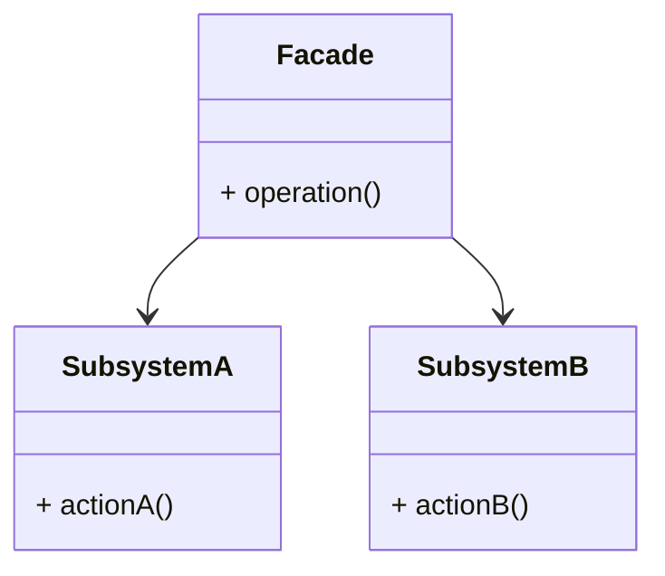
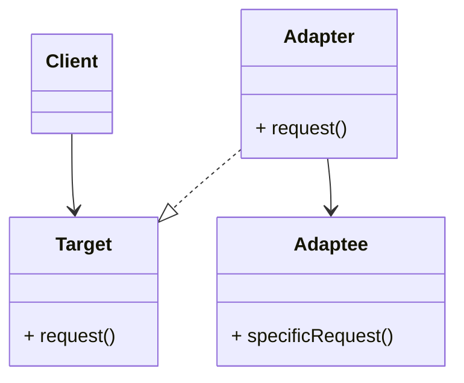
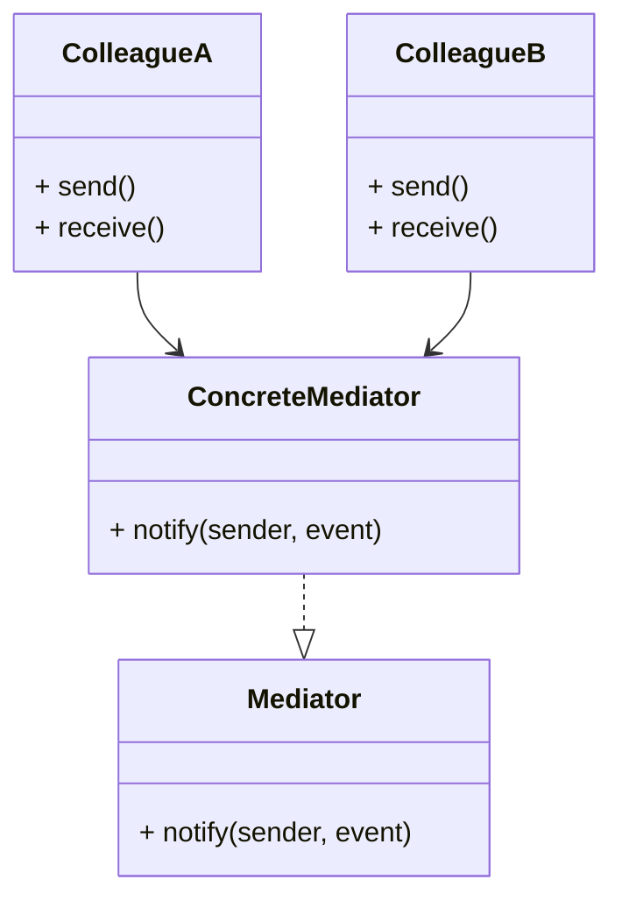

# ACTIVIDAD 22

## Patrones

### Facade

#### Ejercicios Teóricos

##### 1. Comparativa de patrones

**a.** Describe en un diagrama UML las responsabilidades de cada patrón.

- Facade

- Adapter

- Mediator

**b.** Explica por qué elegimos Facade para desacoplar módulos de Terraform y Python en lugar de, por ejemplo, Adapter.

Usamos el patron Facade ya que su función principal es simplificar la interacción de un sistema complejo a usar una interfaz unificada. Cuando usamos terraform, podemos tener varios archivos, configuraciones o comandos complejos que pueden representar un aumento de complejidad. También, al usar Python, este actua como un intermediario para automatizar o controlar dichos módulos de terraform.

Entonces, la ventaja de usar Facade es que podemos crear una capa intermedia en python que agrupe diversas operaciones de Terraform o que exponga métodos simples al resto del sistema.

Ahora, ¿por qué no usar Adapter?, el patrón adapter se usa cuando tenemos formatos/interfaces incompatibles que necesitan trabajar juntas o cuando querramos hacer que una clase ya existente sea compatible con otras sin modificar el código. En caso que tengamos interfaces incompatibles que necesiten ser usadas directamente, entonces sí seria recomendable aplicar el patrón adapter.

**c.** Discute los pros y contras de usar Facade en IaC a gran escala (mantenimiento, legibilidad, potencial de acoplamiento).

- Pros:

    - Centralizamos la lógica de interacción en una única clase o módulo. Si se cambian los comandos o flujos de Terraform, entonces se modificaría solamente la clase Facade y no todo el sistema.

    - Separa la lógica de negocio o de automatización de la complejidad de los propios scripts terraform. Facilita el cambio de "tecnología" sin afectar al resto del sistema.

    - Al diseñar un buen patrón facade se nos permite reutilizar flujos comunes como `init`. `plan`, etc. de forma estandarizada, evitando así la duplicación de código.

- Contras:

    - Si bien desaclopa del sistema, los clientes del facade quedan "pegados" a su interfaz, entonces, si el diseño del patrón no está bien estructurado desde un inicio, puede romper varios módulos dependientes.

    - Si se trabaja en proyectos pequeños, aplicar dicho patrón puede aumentar la complejidad. A veces, ejecutar los comandos directamente es más práctico.

    - Puede dificultar la depuración ya que la abstracción puede ocultar detalles importantes de la ejecución de Terraform (errores o advertencias).

#### Ejercicios Prácticos

### Adapter

#### Ejercicios Teóricos

#### Ejercicios Prácticos

### Mediator

#### Ejercicios Teóricos

#### Ejercicios Prácticos

## Fases

### Fase 1

### Fase 2

### Fase 3

### Fase 4

### Fase 5

### Fase 6

### Fase 7

### Fase 8

### Fase 9

## Ejercicios Adicionales

### Ejercicio 1

### Ejercicio 2

### Ejercicio 3

### Ejercicio 4

### Ejercicio 5

### Ejercicio 6

### Ejercicio 7

### Ejercicio 8

### Ejercicio 9

### Ejercicio 10

### Ejercicio 11

### Ejercicio 12

### Ejercicio 13

### Ejercicio 14

### Ejercicio 15

### Ejercicio 16

