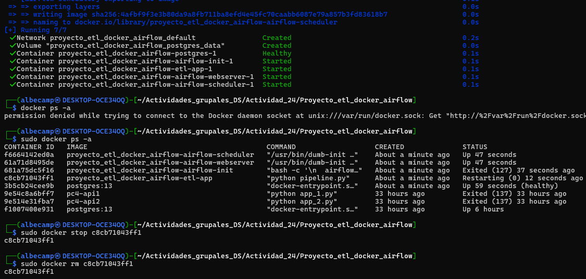
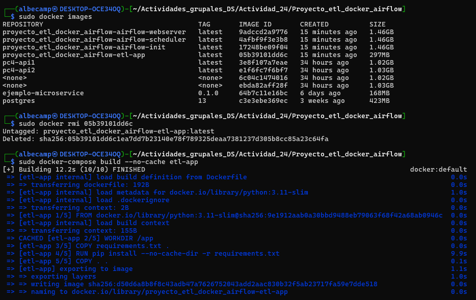
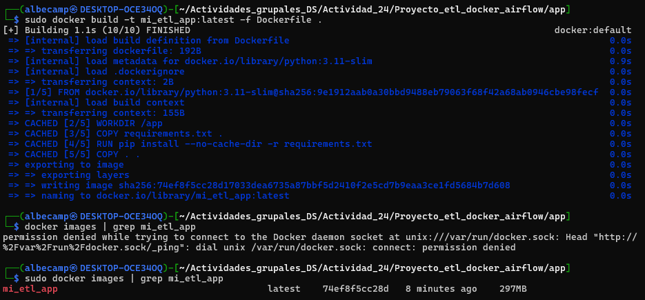
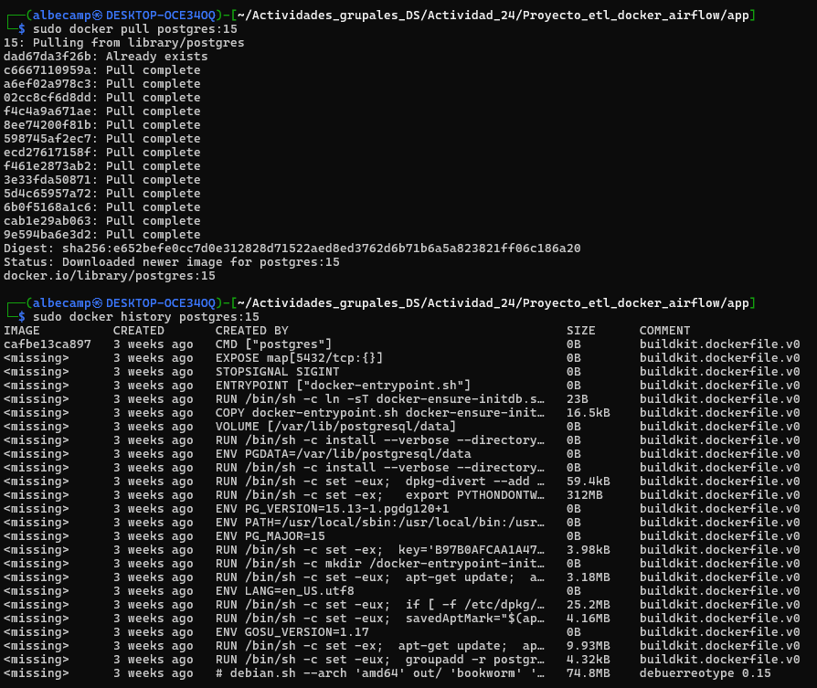

# Actividad 24

### 1. Explora tus contenedores activos y parado

<div align = "center">
    
</div>

Primero se levanta los contenedores con el comando:

```bash
sudo docker-compose up -d
```

Dicho comando pondrá el proyecto en segundo plano.

Luego, se enlista todos los contenedos que tengamos actualmente, ya sea en estado `runnging` o `stopped`

```bash
sudo docker ps -a
```

Luego, nos piden parar y eliminar el contenedor llamado `etl-app` usando su CONTAINER ID. En nuestro caso, el ID de `etl-app` es `c8cb71043ff1`, por lo cual ejecutamos:

```bash
sudo docker stop c8cb71043ff1
sudo docker rm c8cb71043ff1
```

Con dicho comando eliminamos el contenedor, entonces, al volver a ejecutar `sudo docker ps -a` ya no aparecerá dicho contenedor.

### 2. Inspecciona imágenes y limpia tu sistema

<div align = "center">
    
</div>

Primero, se listan todas las imágenes locales disponibles en el sistema Docker:

```bash
sudo docker images
```

Este comando muestra una tabla con las imágenes que tienes descargadas o construidas localmente, incluyendo columnas como `REPOSITORY`, `TAG`, `IMAGE ID` y `CREATED`.

Luego, nos piden eliminar la imagen llamada `etl-app` si ya no la necesitamos. En nuestro caso, el `IMAGE ID` de `etl-app` es `05b39101dd6c`, por lo cual ejecutamos:

```bash
sudo docker rmi 05b39101dd6c
```

Finalmente, si necesitamos volver a construir la imagen del servicio `etl-app`, forzando que no use ninguna caché previa (o sea, que reconstruya desde cero), usamos el siguiente comando:

```bash
sudo docker-compose build --no-cache etl-app
```

Este comando es útil cuando hemos realizado cambios en el `Dockerfile` o en los archivos que forman parte de la construcción y queremos asegurarnos de que todos los pasos se ejecuten nuevamente sin reutilizar capas anteriores.

### 3. Construye una imagen paso a paso

<div align = "center">
    
</div>

Desde la carpeta raíz del proyecto, se crea manualmente la imagen de la aplicación ETL utilizando el `Dockerfile`:

```bash
sudo docker build -t mi_etl_app:latest -f Dockerfile .
```

Este comando construye la imagen usando el archivo `Dockerfile` ubicado en la raíz, y le asigna la etiqueta (`tag`) `mi_etl_app:latest`.

Luego, para verificar que la imagen se ha creado correctamente, se puede ejecutar el siguiente comando y filtrar el resultado por el nombre de la imagen:

```bash
sudo docker images | grep mi_etl_app
```

Esto debería mostrar una línea que contiene el nombre `mi_etl_app`, su etiqueta `latest`, su `IMAGE ID`, la fecha de creación y el tamaño de la imagen.

### 4. Tira de imágenes desde Docker Hub

<div align = "center">
    
</div>

Se descarga la imagen oficial de PostgreSQL, versión 15, desde Docker Hub con el siguiente comando:

```bash
sudo docker pull postgres:15
```

Este comando obtiene todas las capas necesarias para ejecutar un contenedor con PostgreSQL versión 15. En este caso, el resultado mostró la descarga y extracción de múltiples capas, y finalmente:

```
Status: Downloaded newer image for postgres:15
docker.io/library/postgres:15
```

Una vez descargada la imagen, se puede inspeccionar su historial de construcción (layers) con:

```bash
sudo docker history postgres:15
```

Este comando muestra una lista detallada de las capas de la imagen, indicando:
- Cuándo fueron creadas.
- Qué comando ejecutó cada capa (`RUN`, `ENV`, `COPY`, etc.).
- Cuánto espacio ocupa cada una.

Por ejemplo, entre las capas listadas se encuentran:

```
IMAGE          CREATED       CREATED BY                                      SIZE      
cafbe13ca897   3 weeks ago   CMD ["postgres"]                                0B        
<missing>      3 weeks ago   EXPOSE map[5432/tcp:{}]                         0B        
<missing>      3 weeks ago   RUN /bin/sh -c set -eux;  apt-get update;  a…   3.18MB    
<missing>      3 weeks ago   COPY docker-entrypoint.sh docker-ensure-init…   16.5kB    
```


